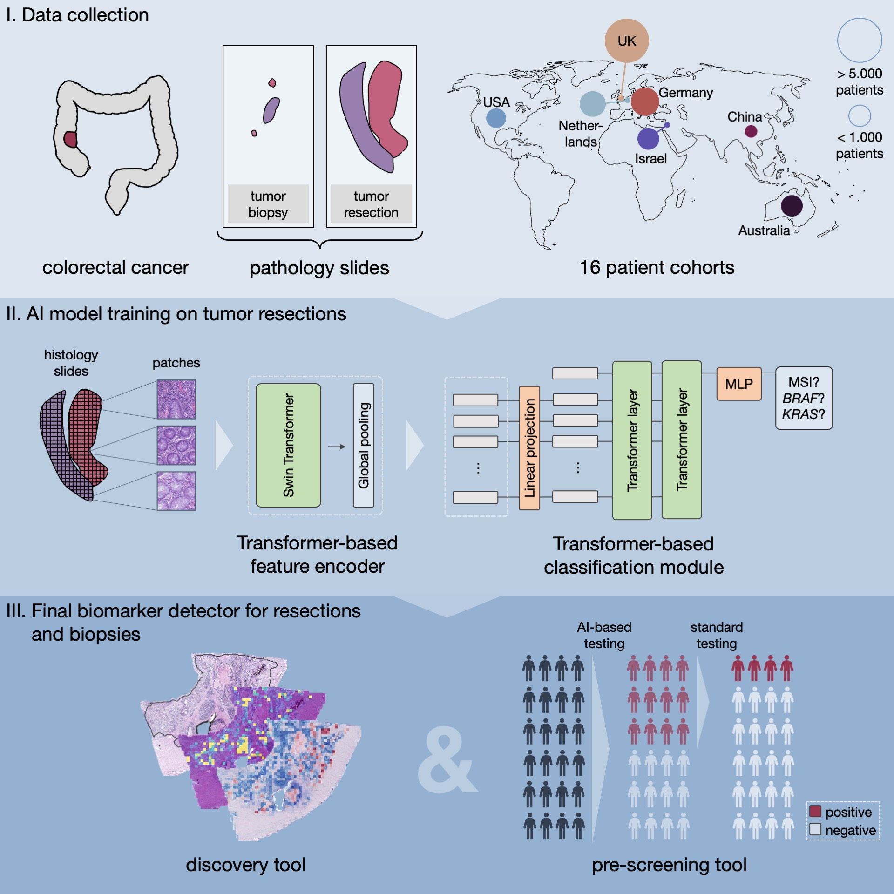

# Transformer-based biomarker prediction from colorectal cancer histology: A large-scale multicentric study

    
<b>Abstract:</b> Deep learning (DL) can accelerate the prediction of prognostic biomarkers from routine pathology slides in colorectal cancer (CRC). However, current approaches rely on convolutional neural networks (CNNs) and have mostly been validated on small patient cohorts. Here, we develop a new transformer-based pipeline for end-to-end biomarker prediction from pathology slides by combining a pre-trained transformer encoder with a transformer network for patch aggregation. Our transformer-based approach substantially improves the performance, generalizability, data efficiency, and interpretability as compared with current state-of-the-art algorithms. After training and evaluating on a large multicenter cohort of over 13,000 patients from 16 colorectal cancer cohorts, we achieve a sensitivity of 0.99 with a negative predictive value of over 0.99 for prediction of microsatellite instability (MSI) on surgical resection specimens. We demonstrate that resection specimen-only training reaches clinical-grade performance on endoscopic biopsy tissue, solving a long-standing diagnostic problem. 

    

<!--  -->

## Folder structure
In  this folder you find additional resources used for the publication that are not contained in the main repository:在这个文件夹中，您会找到用于刊物的其他资源，这些资源没有包含在主要的存储库中：
* `trained_models`: Folder with our models trained on the multicentric dataset for MSI high, BRAF, and KRAS prediction.文件夹中包含我们在多中心数据集上训练的模型，用于MSI高、BRAF和KRAS的预测。
    * `BRAF_CRC_model.pth`
    * `KRAS_CRC_model.pth`
    * `MSI_high_CRC_model.pth`
* `visualizations`: Folder with resourcesd for the visualizations in the publication.文件夹中包含用于刊物可视化的资源。
    * `Visualize_results.ipynb`: Jupyter notebook to visualize the results and plot the data overview figure.Jupyter notebook 用于可视化结果和绘制数据概览图。
    * `UserStudy.ipynb`: Jupyter notebook to evaluate the user study.Jupyter notebook 用于评估用户研究。
* `config.yaml`: Config file used for training the models.用于训练模型的配置文件。
* `evaluations_user_study.xlsx`: Table with expert evaluations of high attention tiles from the user study.用户研究中专家对高关注区块的评估表格。
* `experimental_results.xlsx`: Table with all experimental results.包含所有实验结果的表格。
* `train_num_samples.py`: Script to train models with different numbers of training samples.训练使用不同数量训练样本的模型的脚本。
