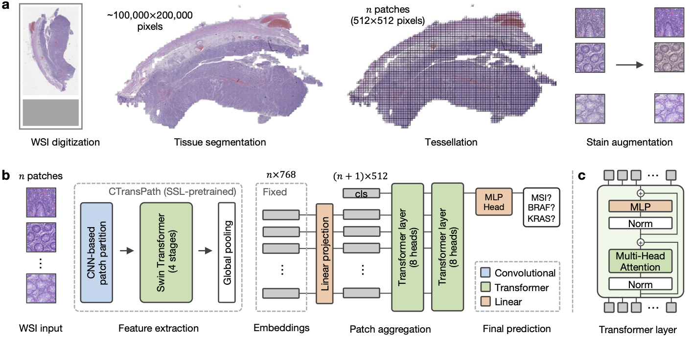

# HistoBistro

Pipeline for weakly-supervised learning on histology images. The pipeline contains various models for multiple instance learning with different aggregation models. Based on Pytorch Lightning. All aggregation modules can be loaded as model files in the classifier lightning module. Loss, models, optimizers, and schedulers can be specified as strings according to the PyTorch name in the config file.弱监督学习在组织学图像上的流程。该流程包含用于多实例学习的各种模型，具有不同的聚合模型，基于 PyTorch Lightning 构建。所有聚合模块都可以作为模型文件加载到分类器的 Lightning 模块中。损失、模型、优化器和调度器可以根据配置文件中的 PyTorch 名称指定为字符串。



## Repository structure
```
├── CancerCellCRCTransformer        # materials for the publication 发表论文的材料
├── models                          # all model files 所有的模型文件
│   ├── aggregators
│   │   ├── __init__.py  
│   │   ├── aggregator              # base class for aggregation modules 聚合模块的基类
│   │   ├── attentionmil.py         # model by Ilse et al., 2018 Ilse 等人的模型，2018
│   │   ├── lamil.py                # model by Reisenbüchler et al., 2022 Reisenbüchler 等人的模型，2022
│   │   ├── model_utils.py          # common layers and functions used in the other models 在其他模型中使用的常见层和函数
│   │   ├── perceiver.py            # model by Jaegle et al., 2021 Jaegle 等人的模型，2021
│   │   ├── test_aggregators.py     # test new aggregators 测试新的聚合器
│   │   ├── transformer.py          # CancerCellCRCTransformer model CancerCellCRCransformer模型
│   │   ├── transmil.py             # model by Shao et al. 2021 Shao 等人的模型，2021
├── classifier.py                   # lightning module for feature classification 用于特征分类的 Lightning 模块
├── config.yaml                     # config file for training 用于训练的配置文件
├── data.py                         # dataset class and helper functions 数据集类和辅助函数
├── environment.yaml                # config file for conda environment conda 环境的配置文件
├── main.py                         # train and test models 训练和测试模型
├── train_k-fold.py                 # train models with k-fold cross validation 使用 K 折交叉验证训练模型
├── test_k-fold.py                  # test models with k-fold cross validation 使用 K 折交叉验证测试模型
├── test.py                         # test models (e.g., CancerCellCRCTransformer models) 测试模型（例如，CancerCellCRCTransformer模型）
├── options.py                      # argument parsing, overrides config file when arguments are given 解析命令行参数，当给定参数时覆盖配置文件
├── Evaluations.ipynb               # visualize attention and classification score heatmaps 可视化注意力和分类得分热图
├── Visualizations.ipynb            # plot metric curves (ROC, PRC) and analyze clinicopathological features 绘制指标曲线（ROC，PRC）并分析临床病理特征
├── utils.py                        # get files and other utils 获取文件和其他工具
```

## Setup

Setup `data_config.yaml` and `config.yaml` with your data paths and training configurations. All entries in brackets `< >` should be customized. 设置`data_config.yaml`和`config.yaml`，填入您的数据路径和训练配置。所有方括号`< >`中的条目都应根据您的实际情况进行自定义。

Install the following packages needed for a minimal working environement: 安装以下用于最小工作环境的软件包：
* mamba/conda: `pytorch pytorch-lightning wandb einops pyparsing h5py pandas`
* pip: `dgl`

Alternatively, install the conda env from `environment.yaml`: 或者，从`environment.yaml`中安装Conda环境：
```sh
conda env create --file environment.yaml
```

## Data structure

* `clini_table.xlsx`: Table (Excel-file) with clinically important labels. Each patient has a unique entry, column names `PATIENT` and `TARGET` are required. 包含临床重要标签的表格（Excel文件）。每位患者都有一个唯一的条目，必须包含列名`PATIENT`和`TARGET`。

| PATIENT	| TARGET	| GENDER	| AGE |
| ---       | ---       | ---       | --- |
| ID_345    | positive	| female	| 61  |
| ID_459    | negative	| male	    | 67  |
| ID_697    | NA	    | female	| 42  |

* `slide.csv`: Table (csv-file) with patient id's matched with slide / file names (column names `FILENAME` and `PATIENT`). Patients can have multiple entries if they have multiple slides. 包含患者ID与切片/文件名匹配的表格（CSV文件）。如果患者有多个切片，则可能会有多个条目，列名为`FILENAME`和`PATIENT`。

| FILENAME	| PATIENT	|
| ---       | ---       |
| ID_345_slide01    | ID_345    |
| ID_345_slide02    | ID_345    |
| ID_459_slide01    | ID_459    |

* folder with features as `.h5-files`. Filenames correspond to filenames in `slide.csv` 包含特征的文件夹，以`.h5`文件形式存储。文件名与`slide.csv`中的文件名对应。


## Training

You can train your model on a multi-centric dataset with the following k-fold cross validation (k=5) scheme where `--` (train) `**` (val), and `##` (test). 您可以在一个多中心数据集上使用以下的k折交叉验证（k=5）方案进行模型训练，其中`--`表示训练集，`**`表示验证集，`##`表示测试集。
```
[--|--|--|**|##]
[--|--|**|##|--]
[--|**|##|--|--]
[**|##|--|--|--]
[##|--|--|--|**]
```

by running 
```
python train_k-fold.py --name <name> --data_config <path/to/data_config.yaml> --config <path/to/config.yaml>
```
and test it on the in-domain test set and external cohorts by running 并在域测试集和外部队列上进行测试。
```
python test_k-fold.py --name <name> --data_config <path/to/data_config.yaml> --config <path/to/config.yaml>
```

## Testing

You can test a given model with the following command: 您可以使用以下命令测试给定的模型：
```
python test.py --model_path <path/to/model.ckpt> --name <custom-name> --config_file <path/to/config.yaml> --data_config <path/to/data_config.yaml>
```

You can find the models for **MSI high**, **BRAF**, and **KRAS** prediction from the publication "Transformer-based biomarker prediction from colorectal cancer histology: A large-scale multicentric study" trained on the multicentric cohort in the folder `CancerCellCRCTransformer/trained_models` in this repo. 您可以在此存储库的`CancerCellCRCTransformer/trained_models`文件夹中找到基于Transformer的生物标志物预测模型，用于**MSI高**、**BRAF**和**KRAS**的预测，这些模型来自于论文《Transformer-based biomarker prediction from colorectal cancer histology: A large-scale multicentric study》并在多中心队列上进行了训练。

## Publications

Information to publications based on this repository are grouped in the respective folders. Find more detailed information in the README.md files in the respective folders. 有关基于此存储库的出版物的信息已经组织在各自的文件夹中。在各自文件夹的README.md文件中可以找到更详细的信息。

If you consider this useful for your research, please cite our paper: 如果您认为这对您的研究有用，请引用我们的论文：
```
@article{wagner2023transformer,
  title={Transformer-based biomarker prediction from colorectal cancer histology: A large-scale multicentric study},
  author={Wagner, Sophia J and Reisenb{\"u}chler, Daniel and West, Nicholas P and Niehues, Jan Moritz and Zhu, Jiefu and Foersch, Sebastian and Veldhuizen, Gregory Patrick and Quirke, Philip and Grabsch, Heike I and van den Brandt, Piet A and others},
  journal={Cancer Cell},
  publisher={Elsevier}
}
```


